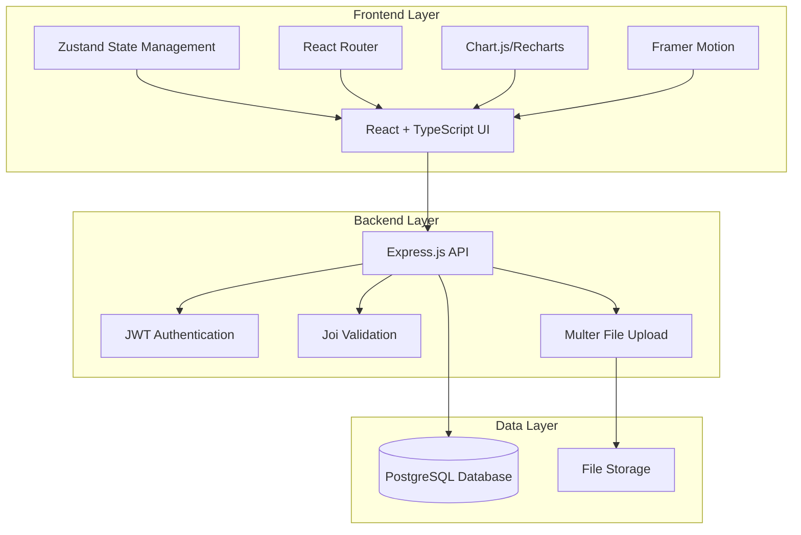
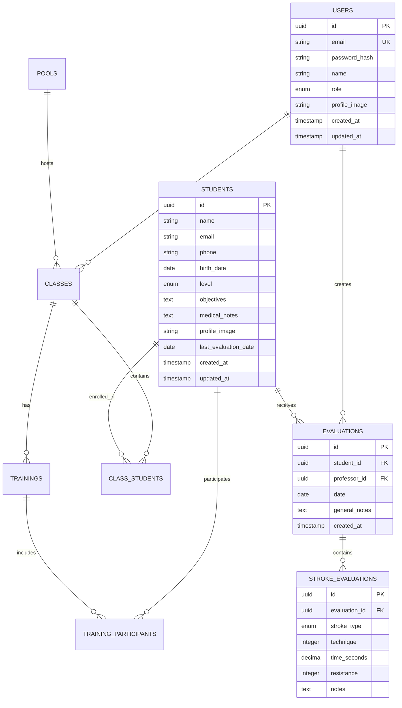

# Design Document: SwimFlow Management System

## Overview

SwimFlow é um sistema web moderno para gestão de alunos de natação, construído com foco em usabilidade, performance e experiência do usuário. O sistema utiliza uma arquitetura moderna baseada em componentes React com TypeScript, backend Node.js/Express, e banco de dados relacional para garantir escalabilidade e manutenibilidade.

O design prioriza uma interface intuitiva com paleta de cores azul oceano/teal, animações suaves com Framer Motion, e visualizações de dados elegantes para facilitar o acompanhamento da evolução dos alunos.

## Architecture

### System Architecture



### Technology Stack

**Frontend:**
- React 18 com TypeScript para type safety
- Zustand para gerenciamento de estado global
- React Router para navegação
- Tailwind CSS para estilização
- Framer Motion para animações
- Chart.js ou Recharts para gráficos
- React Hook Form para formulários

**Backend:**
- Node.js com Express.js
- TypeScript para consistência de tipos
- JWT para autenticação
- Joi para validação de dados
- Multer para upload de arquivos
- bcrypt para hash de senhas

**Database:**
- PostgreSQL como banco principal
- Prisma como ORM
- Redis para cache (opcional)

## Components and Interfaces

### Core Components

#### 1. Authentication System
```typescript
interface AuthService {
  login(credentials: LoginCredentials): Promise<AuthResult>
  logout(): Promise<void>
  refreshToken(): Promise<string>
  getCurrentUser(): Promise<User>
}

interface User {
  id: string
  email: string
  name: string
  role: 'admin' | 'professor'
  profileImage?: string
  createdAt: Date
  updatedAt: Date
}
```

#### 2. Student Management
```typescript
interface StudentService {
  createStudent(data: CreateStudentData): Promise<Student>
  updateStudent(id: string, data: UpdateStudentData): Promise<Student>
  getStudent(id: string): Promise<Student>
  listStudents(filters?: StudentFilters): Promise<Student[]>
  uploadStudentImage(id: string, file: File): Promise<string>
}

interface Student {
  id: string
  name: string
  email?: string
  phone?: string
  birthDate: Date
  level: 'iniciante' | 'intermediario' | 'avancado'
  objectives: string
  medicalNotes?: string
  profileImage?: string
  lastEvaluationDate?: Date
  createdAt: Date
  updatedAt: Date
}
```

#### 3. Class and Pool Management
```typescript
interface ClassService {
  createClass(data: CreateClassData): Promise<Class>
  updateClass(id: string, data: UpdateClassData): Promise<Class>
  getClass(id: string): Promise<Class>
  listClasses(professorId?: string): Promise<Class[]>
  addStudentToClass(classId: string, studentId: string): Promise<void>
  removeStudentFromClass(classId: string, studentId: string): Promise<void>
}

interface Class {
  id: string
  name: string
  professorId: string
  poolId: string
  schedule: ClassSchedule[]
  students: Student[]
  maxCapacity: number
  createdAt: Date
  updatedAt: Date
}

interface Pool {
  id: string
  name: string
  capacity: number
  length: number
  lanes: number
  temperature?: number
  description?: string
}
```

#### 4. Training and Evaluation System
```typescript
interface TrainingService {
  createTraining(data: CreateTrainingData): Promise<Training>
  getTraining(id: string): Promise<Training>
  listTrainings(filters?: TrainingFilters): Promise<Training[]>
}

interface EvaluationService {
  createEvaluation(data: CreateEvaluationData): Promise<Evaluation>
  getEvaluation(id: string): Promise<Evaluation>
  listEvaluations(studentId: string): Promise<Evaluation[]>
  getEvolutionData(studentId: string): Promise<EvolutionData>
}

interface Training {
  id: string
  classId: string
  date: Date
  duration: number
  activities: string[]
  participants: string[]
  notes?: string
  createdAt: Date
}

interface Evaluation {
  id: string
  studentId: string
  professorId: string
  date: Date
  strokeEvaluations: StrokeEvaluation[]
  generalNotes?: string
  createdAt: Date
}

interface StrokeEvaluation {
  strokeType: 'crawl' | 'costas' | 'peito' | 'borboleta'
  technique: number // 1-10 scale
  time?: number // seconds for standard distance
  resistance: number // 1-10 scale
  notes?: string
}
```

### UI Components

#### 1. Dashboard Components
```typescript
interface DashboardProps {
  user: User
  stats: DashboardStats
}

interface DashboardStats {
  totalStudents: number
  totalClasses: number
  recentEvaluations: number
  upcomingTrainings: Training[]
}
```

#### 2. Student Card Component
```typescript
interface StudentCardProps {
  student: Student
  onEdit: (student: Student) => void
  onViewDetails: (studentId: string) => void
  showLevel?: boolean
  showLastEvaluation?: boolean
}
```

#### 3. Evolution Chart Component
```typescript
interface EvolutionChartProps {
  studentId: string
  strokeType?: StrokeType
  metric: 'technique' | 'time' | 'resistance'
  timeRange: '3months' | '6months' | '1year' | 'all'
}
```

## Data Models

### Database Schema

```sql
-- Users table (professors and admins)
CREATE TABLE users (
  id UUID PRIMARY KEY DEFAULT gen_random_uuid(),
  email VARCHAR(255) UNIQUE NOT NULL,
  password_hash VARCHAR(255) NOT NULL,
  name VARCHAR(255) NOT NULL,
  role VARCHAR(20) NOT NULL CHECK (role IN ('admin', 'professor')),
  profile_image VARCHAR(500),
  created_at TIMESTAMP DEFAULT CURRENT_TIMESTAMP,
  updated_at TIMESTAMP DEFAULT CURRENT_TIMESTAMP
);

-- Students table
CREATE TABLE students (
  id UUID PRIMARY KEY DEFAULT gen_random_uuid(),
  name VARCHAR(255) NOT NULL,
  email VARCHAR(255),
  phone VARCHAR(20),
  birth_date DATE NOT NULL,
  level VARCHAR(20) NOT NULL CHECK (level IN ('iniciante', 'intermediario', 'avancado')),
  objectives TEXT,
  medical_notes TEXT,
  profile_image VARCHAR(500),
  last_evaluation_date DATE,
  created_at TIMESTAMP DEFAULT CURRENT_TIMESTAMP,
  updated_at TIMESTAMP DEFAULT CURRENT_TIMESTAMP
);

-- Pools table
CREATE TABLE pools (
  id UUID PRIMARY KEY DEFAULT gen_random_uuid(),
  name VARCHAR(255) NOT NULL,
  capacity INTEGER NOT NULL,
  length DECIMAL(5,2),
  lanes INTEGER,
  temperature DECIMAL(4,1),
  description TEXT,
  created_at TIMESTAMP DEFAULT CURRENT_TIMESTAMP
);

-- Classes table
CREATE TABLE classes (
  id UUID PRIMARY KEY DEFAULT gen_random_uuid(),
  name VARCHAR(255) NOT NULL,
  professor_id UUID NOT NULL REFERENCES users(id),
  pool_id UUID NOT NULL REFERENCES pools(id),
  max_capacity INTEGER NOT NULL,
  created_at TIMESTAMP DEFAULT CURRENT_TIMESTAMP,
  updated_at TIMESTAMP DEFAULT CURRENT_TIMESTAMP
);

-- Class schedules table
CREATE TABLE class_schedules (
  id UUID PRIMARY KEY DEFAULT gen_random_uuid(),
  class_id UUID NOT NULL REFERENCES classes(id),
  day_of_week INTEGER NOT NULL CHECK (day_of_week BETWEEN 0 AND 6),
  start_time TIME NOT NULL,
  end_time TIME NOT NULL
);

-- Class students (many-to-many)
CREATE TABLE class_students (
  class_id UUID NOT NULL REFERENCES classes(id),
  student_id UUID NOT NULL REFERENCES students(id),
  enrolled_at TIMESTAMP DEFAULT CURRENT_TIMESTAMP,
  PRIMARY KEY (class_id, student_id)
);

-- Trainings table
CREATE TABLE trainings (
  id UUID PRIMARY KEY DEFAULT gen_random_uuid(),
  class_id UUID NOT NULL REFERENCES classes(id),
  date DATE NOT NULL,
  duration INTEGER NOT NULL, -- minutes
  activities TEXT[],
  notes TEXT,
  created_at TIMESTAMP DEFAULT CURRENT_TIMESTAMP
);

-- Training participants (many-to-many)
CREATE TABLE training_participants (
  training_id UUID NOT NULL REFERENCES trainings(id),
  student_id UUID NOT NULL REFERENCES students(id),
  PRIMARY KEY (training_id, student_id)
);

-- Evaluations table
CREATE TABLE evaluations (
  id UUID PRIMARY KEY DEFAULT gen_random_uuid(),
  student_id UUID NOT NULL REFERENCES students(id),
  professor_id UUID NOT NULL REFERENCES users(id),
  date DATE NOT NULL,
  general_notes TEXT,
  created_at TIMESTAMP DEFAULT CURRENT_TIMESTAMP
);

-- Stroke evaluations table
CREATE TABLE stroke_evaluations (
  id UUID PRIMARY KEY DEFAULT gen_random_uuid(),
  evaluation_id UUID NOT NULL REFERENCES evaluations(id),
  stroke_type VARCHAR(20) NOT NULL CHECK (stroke_type IN ('crawl', 'costas', 'peito', 'borboleta')),
  technique INTEGER NOT NULL CHECK (technique BETWEEN 1 AND 10),
  time_seconds DECIMAL(6,2),
  resistance INTEGER NOT NULL CHECK (resistance BETWEEN 1 AND 10),
  notes TEXT
);

-- Indexes for performance
CREATE INDEX idx_students_level ON students(level);
CREATE INDEX idx_students_last_evaluation ON students(last_evaluation_date);
CREATE INDEX idx_evaluations_student_date ON evaluations(student_id, date);
CREATE INDEX idx_classes_professor ON classes(professor_id);
CREATE INDEX idx_trainings_class_date ON trainings(class_id, date);
```

### Data Relationships



## Error Handling

### Error Types and Responses

```typescript
interface ApiError {
  code: string
  message: string
  details?: any
  timestamp: Date
}

enum ErrorCodes {
  VALIDATION_ERROR = 'VALIDATION_ERROR',
  NOT_FOUND = 'NOT_FOUND',
  UNAUTHORIZED = 'UNAUTHORIZED',
  FORBIDDEN = 'FORBIDDEN',
  DUPLICATE_ENTRY = 'DUPLICATE_ENTRY',
  FILE_UPLOAD_ERROR = 'FILE_UPLOAD_ERROR',
  DATABASE_ERROR = 'DATABASE_ERROR'
}
```

### Error Handling Strategy

1. **Input Validation**: Joi schemas validate all input data
2. **Database Errors**: Proper error mapping for constraint violations
3. **File Upload Errors**: Size, type, and storage validation
4. **Authentication Errors**: Clear messaging for auth failures
5. **Network Errors**: Retry mechanisms and offline handling
6. **User Feedback**: Toast notifications and inline error messages

### Validation Rules

```typescript
const studentValidation = Joi.object({
  name: Joi.string().min(2).max(255).required(),
  email: Joi.string().email().optional(),
  phone: Joi.string().pattern(/^\+?[\d\s\-\(\)]+$/).optional(),
  birthDate: Joi.date().max('now').required(),
  level: Joi.string().valid('iniciante', 'intermediario', 'avancado').required(),
  objectives: Joi.string().max(1000).required(),
  medicalNotes: Joi.string().max(2000).optional()
});

const evaluationValidation = Joi.object({
  studentId: Joi.string().uuid().required(),
  date: Joi.date().max('now').required(),
  strokeEvaluations: Joi.array().items(
    Joi.object({
      strokeType: Joi.string().valid('crawl', 'costas', 'peito', 'borboleta').required(),
      technique: Joi.number().integer().min(1).max(10).required(),
      timeSeconds: Joi.number().positive().optional(),
      resistance: Joi.number().integer().min(1).max(10).required(),
      notes: Joi.string().max(500).optional()
    })
  ).min(1).required(),
  generalNotes: Joi.string().max(1000).optional()
});
```

## Testing Strategy

O SwimFlow utilizará uma abordagem dual de testes para garantir qualidade e confiabilidade:

### Unit Testing
- **Framework**: Jest com Testing Library para componentes React
- **Coverage**: Mínimo 80% de cobertura de código
- **Focus**: Lógica de negócio, validações, e casos extremos
- **Mocking**: APIs externas e dependências de banco de dados

### Property-Based Testing
- **Framework**: fast-check para JavaScript/TypeScript
- **Configuration**: Mínimo 100 iterações por teste de propriedade
- **Focus**: Propriedades universais que devem ser mantidas
- **Integration**: Cada propriedade referencia o documento de design

### Test Categories
1. **Component Tests**: Renderização e interação de componentes UI
2. **Service Tests**: Lógica de negócio e integração com APIs
3. **Integration Tests**: Fluxos completos entre frontend e backend
4. **Property Tests**: Validação de propriedades universais do sistema
5. **E2E Tests**: Cypress para fluxos críticos do usuário

### Test Data Management
- **Factories**: Geração de dados de teste consistentes
- **Fixtures**: Dados estáticos para cenários específicos
- **Database Seeding**: População de dados para testes de integração
- **Cleanup**: Limpeza automática após cada teste

## Correctness Properties

*A property is a characteristic or behavior that should hold true across all valid executions of a system-essentially, a formal statement about what the system should do. Properties serve as the bridge between human-readable specifications and machine-verifiable correctness guarantees.*

### Property 1: Data Validation and Persistence
*For any* valid entity data (student, professor, pool, class, training, evaluation), when the data is submitted to the system, it should be validated according to business rules and successfully persisted to the database
**Validates: Requirements 1.2, 2.1, 3.1, 4.2, 9.1**

### Property 2: Search and Filter Accuracy
*For any* search criteria and dataset, all returned results should match the search criteria and no matching items should be excluded from the results
**Validates: Requirements 1.4**

### Property 3: List Display Completeness
*For any* collection of entities (students, classes, trainings, evaluations), when displayed as a list, all entities should be present and contain their essential information
**Validates: Requirements 1.3, 2.3, 4.3, 5.4**

### Property 4: Image Upload and Update
*For any* valid image file and entity (student or professor), uploading the image should successfully update the entity's profile image and maintain system integrity
**Validates: Requirements 1.5, 2.4**

### Property 5: Association Integrity
*For any* valid association between entities (student-class, class-pool, training-participants), creating the association should establish the relationship correctly and maintain referential integrity
**Validates: Requirements 2.2, 3.2**

### Property 6: Evaluation Data Capture
*For any* evaluation with stroke data, the system should capture and store technique scores, times, resistance levels, and notes for each specified stroke type
**Validates: Requirements 5.1, 5.2**

### Property 7: Automatic Data Updates
*For any* evaluation save operation, the system should automatically update the student's last evaluation date and trigger updates to evolution charts
**Validates: Requirements 5.3, 6.4**

### Property 8: Chronological Ordering
*For any* time-based data collection (trainings, evaluations, evolution timeline), the system should maintain and display items in correct chronological order
**Validates: Requirements 4.3, 6.2**

### Property 9: Evolution Data Visualization
*For any* student with evaluation history, the system should generate accurate charts showing progress trends for each stroke type and metric
**Validates: Requirements 6.1, 6.3**

### Property 10: Level Management
*For any* student level change, the system should validate the new level against allowed values and record the change with timestamp
**Validates: Requirements 7.1, 7.3**

### Property 11: Visual Level Display
*For any* class with enrolled students, the system should display each student's current level accurately in the class view
**Validates: Requirements 7.2**

### Property 12: Operation Feedback
*For any* successful save operation, the system should provide clear confirmation to the user and update the UI to reflect the changes
**Validates: Requirements 9.2**

### Property 13: Error Handling and Data Preservation
*For any* system error during data entry, the system should preserve already-entered data and provide informative error messages to the user
**Validates: Requirements 9.3**

### Property 14: Temporal Data Consistency
*For any* historical data access, the system should maintain accurate timestamps and ensure data integrity across time-based queries
**Validates: Requirements 9.4**

### Property 15: Evaluation Round Trip
*For any* evaluation data, saving and then retrieving the evaluation should return equivalent data with all stroke evaluations intact
**Validates: Requirements 5.2, 5.4**

## User Interface Design

### Design System

#### Color Palette
```css
:root {
  /* Primary Ocean Blues */
  --ocean-50: #f0f9ff;
  --ocean-100: #e0f2fe;
  --ocean-200: #bae6fd;
  --ocean-300: #7dd3fc;
  --ocean-400: #38bdf8;
  --ocean-500: #0ea5e9;
  --ocean-600: #0284c7;
  --ocean-700: #0369a1;
  --ocean-800: #075985;
  --ocean-900: #0c4a6e;

  /* Teal Accents */
  --teal-50: #f0fdfa;
  --teal-100: #ccfbf1;
  --teal-200: #99f6e4;
  --teal-300: #5eead4;
  --teal-400: #2dd4bf;
  --teal-500: #14b8a6;
  --teal-600: #0d9488;
  --teal-700: #0f766e;
  --teal-800: #115e59;
  --teal-900: #134e4a;

  /* Vibrant Accents */
  --coral-400: #fb7185;
  --coral-500: #f43f5e;
  --amber-400: #fbbf24;
  --amber-500: #f59e0b;
  
  /* Neutrals */
  --gray-50: #f8fafc;
  --gray-100: #f1f5f9;
  --gray-200: #e2e8f0;
  --gray-300: #cbd5e1;
  --gray-400: #94a3b8;
  --gray-500: #64748b;
  --gray-600: #475569;
  --gray-700: #334155;
  --gray-800: #1e293b;
  --gray-900: #0f172a;
}
```

#### Typography
```css
/* Font Stack */
font-family: 'Inter', -apple-system, BlinkMacSystemFont, 'Segoe UI', Roboto, sans-serif;

/* Type Scale */
--text-xs: 0.75rem;    /* 12px */
--text-sm: 0.875rem;   /* 14px */
--text-base: 1rem;     /* 16px */
--text-lg: 1.125rem;   /* 18px */
--text-xl: 1.25rem;    /* 20px */
--text-2xl: 1.5rem;    /* 24px */
--text-3xl: 1.875rem;  /* 30px */
--text-4xl: 2.25rem;   /* 36px */
```

#### Component Patterns

**Cards with Gradients:**
```css
.card {
  background: linear-gradient(135deg, var(--ocean-50) 0%, var(--teal-50) 100%);
  border: 1px solid var(--ocean-200);
  border-radius: 12px;
  box-shadow: 0 1px 3px rgba(0, 0, 0, 0.1);
  transition: all 0.2s ease;
}

.card:hover {
  transform: translateY(-2px);
  box-shadow: 0 4px 12px rgba(0, 0, 0, 0.15);
}
```

**Level Indicators:**
```css
.level-badge {
  padding: 4px 12px;
  border-radius: 20px;
  font-size: var(--text-sm);
  font-weight: 500;
}

.level-iniciante { background: var(--amber-100); color: var(--amber-800); }
.level-intermediario { background: var(--ocean-100); color: var(--ocean-800); }
.level-avancado { background: var(--teal-100); color: var(--teal-800); }
```

### Key UI Components

#### Dashboard Layout
```typescript
interface DashboardLayout {
  header: NavigationHeader
  sidebar: NavigationSidebar
  mainContent: DashboardContent
  notifications: NotificationCenter
}

interface DashboardContent {
  statsCards: StatsCard[]
  recentActivity: ActivityFeed
  quickActions: ActionButton[]
  upcomingEvents: EventList
}
```

#### Student Card Design
```typescript
interface StudentCardProps {
  student: Student
  showLevel: boolean
  showLastEvaluation: boolean
  compact?: boolean
}

// Visual hierarchy:
// - Profile image (circular, 48px)
// - Name (text-lg, font-semibold)
// - Level badge (colored, rounded)
// - Last evaluation date (text-sm, gray)
// - Action buttons (edit, view details)
```

#### Evolution Chart Configuration
```typescript
interface ChartConfig {
  type: 'line' | 'bar' | 'area'
  strokeType: StrokeType
  metric: 'technique' | 'time' | 'resistance'
  timeRange: TimeRange
  colors: {
    primary: string
    secondary: string
    grid: string
  }
  animations: {
    duration: number
    easing: string
  }
}
```

### Responsive Design

#### Breakpoints
```css
/* Mobile First Approach */
--mobile: 320px;
--tablet: 768px;
--desktop: 1024px;
--wide: 1280px;
```

#### Layout Adaptations
- **Mobile (< 768px)**: Single column, collapsible sidebar, stacked cards
- **Tablet (768px - 1024px)**: Two column grid, slide-out sidebar
- **Desktop (> 1024px)**: Full layout with persistent sidebar, three column grids

### Animation Guidelines

#### Framer Motion Variants
```typescript
const cardVariants = {
  hidden: { opacity: 0, y: 20 },
  visible: { 
    opacity: 1, 
    y: 0,
    transition: { duration: 0.3, ease: "easeOut" }
  },
  hover: {
    y: -4,
    transition: { duration: 0.2, ease: "easeInOut" }
  }
}

const listVariants = {
  hidden: { opacity: 0 },
  visible: {
    opacity: 1,
    transition: {
      staggerChildren: 0.1,
      delayChildren: 0.2
    }
  }
}
```

#### Performance Considerations
- Use `transform` and `opacity` for animations
- Implement `will-change` for animated elements
- Lazy load charts and heavy components
- Optimize images with WebP format and responsive sizing

## Security Considerations

### Authentication & Authorization
- JWT tokens with refresh mechanism
- Role-based access control (admin, professor)
- Session timeout and automatic logout
- Password strength requirements and hashing with bcrypt

### Data Protection
- Input sanitization and validation
- SQL injection prevention through parameterized queries
- XSS protection with Content Security Policy
- File upload restrictions (type, size, scanning)

### API Security
- Rate limiting to prevent abuse
- CORS configuration for allowed origins
- Request logging and monitoring
- Error messages that don't expose system details

### Privacy Compliance
- Data encryption at rest and in transit
- User consent for data processing
- Right to data deletion (LGPD compliance)
- Audit logs for data access and modifications